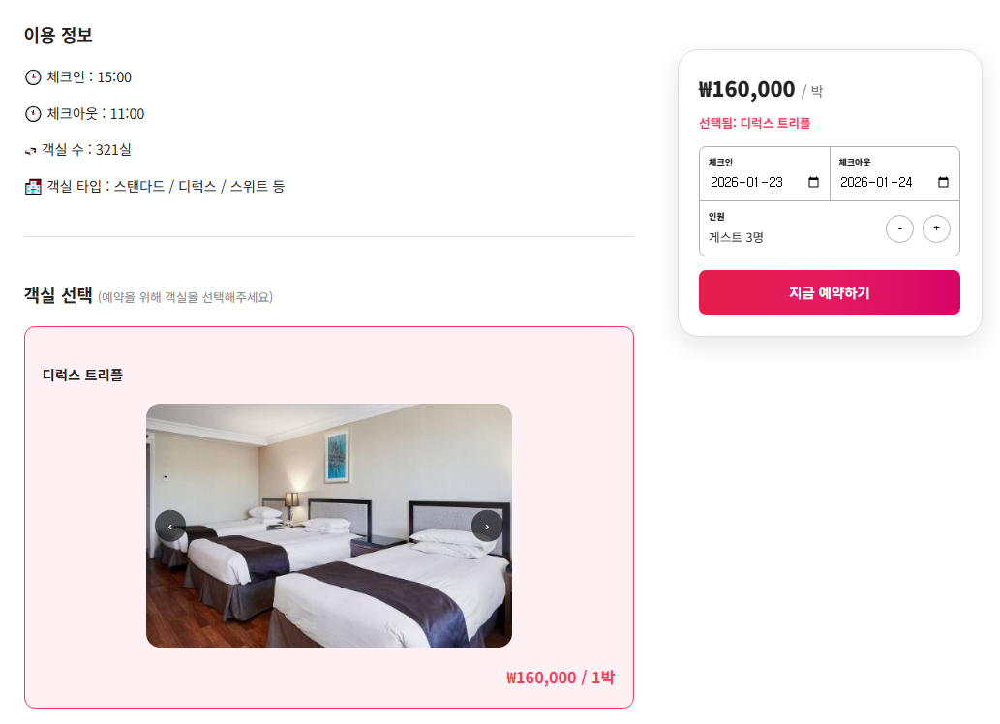

# 🌏 I'm Ready
> **테마 기반 한국 여행 추천 · 코스 생성 · 예약 통합 플랫폼**

---

## 📋 프로젝트 개요
**IMREADY**는 사용자가 선택한 **여행 테마·지역·기간·예산**을 기반으로  
여행 코스를 추천하고, 직접 커스터마이징하여 **예약·결제·리뷰까지 이어지는** 통합 여행 추천 플랫폼입니다.

단순한 여행지 나열이 아닌,  
**선택 → 추천 → 코스 생성 → 예약 → 후기**로 이어지는  
하나의 완성된 여행 경험 흐름을 제공하는 것을 목표로 합니다.

---

## 📌 프로젝트 소개
사용자는  
- 가족 / 연인 / 친구 / 혼행 / 기념일 / 힐링 등 **테마를 중복 선택**하고  
- 지역, 일정, 예산 조건을 입력하여  
- 추천된 숙박·관광·식당 POI를 조합해 **나만의 여행 코스(패키지)**를 생성할 수 있습니다.

추천 로직은 **테마별 가중치 기반 점수 계산 방식**을 사용하며,  
외부 관광 데이터는 **온디맨드 API 방식**으로 조회하여  
불필요한 대용량 데이터 적재 없이 효율적인 구조로 설계되었습니다.

여행 완료 후에는 **리뷰 작성 → 포인트 적립 → 커뮤니티 공유**까지 이어지며,  
프리미엄 유저에게는 **코스 복제·커스터마이징 기능**을 제공하여  
차별화된 사용자 경험을 구현했습니다.

---

## ⏳ 개발 기간
🗓 **총 개발 기간:** 2025.10.21 ~ 2025.11.10

| 구분 | 기간 | 주요 내용 |
|------|------|----------|
| 기획 | 10.21 ~ 10.27 | 아이디어 정의, 기능 기획, DB 설계 |
| 개발 | 10.27 ~ 11.10 | 기능 구현, 화면 개발 |
| 개선 | 11.11 ~ | 리팩터링 및 기능 보완 |

---

## 😀 팀원 구성
| 이름 | 역할 | GitHub |
|------|------|--------|
| 이동준 | PM / 여행 추천·코스 생성 / 메인 페이지 | https://github.com/LeeDongjun00 |
| 박충현 | 인증·결제·회원 관리 / 관리자 페이지 | https://github.com/3y5adf |
| 하송화 | 커뮤니티 페이지 / 공지 페이지 | https://github.com/hasonghwa |
| 유희연 | 리뷰·찜·예약 조회 / 메인 페이지 | https://github.com/hee8144 |

---

## 🖥️ 기술 스택
| 구분 | 기술 |
|------|------|
| Backend | Java, Spring Boot |
| Frontend | JSP, Vue.js, jQuery, HTML5, CSS3, JavaScript |
| Database | Oracle |
| API | 한국관광공사 OPEN API, Kakao Map / Navi / Login, PortOne, SMS |
| Payment | PayPal, 카드 결제 |
| Collaboration | GitHub, Notion, Figma |

---

## 🖍 차별점
- **테마 가중치 기반 추천 로직** 단순 필터링이 아닌 속성 점수 계산을 통한 우선순위 추천
- **온디맨드 API 설계** CONTENT_ID 기반 최소 데이터 저장으로 성능·유지보수 고려
- **실제 예약 흐름 연계** 코스 생성 → 결제 → 리뷰 → 포인트 적립까지 연결
- **프리미엄 유저 차등 경험** 코스 복제·커스터마이징 기능 제공

---

## 📽 서비스 핵심 플로우 (Service Flow)
**IMREADY**는 복잡한 여행 준비 과정을 **'조건 입력 → 코스 최적화 → 예약'**으로 이어지는 직관적인 플로우로 제공합니다.

### 1️⃣ 조건 설정 및 테마 가중치 배분
사용자가 선호하는 여행 테마와 지역, 예산을 입력하고 각 카테고리(숙박, 식당, 체험 등)별 예산 비중을 직접 조절하여 맞춤형 추천의 기초를 만듭니다.

| 테마 및 지역 선택 | 예산 비중 설정 |
| :---: | :---: |
|  |  |

### 2️⃣ 테마 기반 추천 및 코스 최적화
설정된 가중치를 바탕으로 추천된 장소들을 지도에서 확인하고, 드래그 앤 드롭을 통해 여행 동선을 자유롭게 최적화합니다.

| &nbsp; |
| :---: |
|  |

### 3️⃣ 경로 시각화 및 최종 동선 확인
선택된 장소들 간의 최단 경로를 **Kakao Map API**로 탐색하여 총 이동 거리와 예상 소요 시간을 실시간으로 산출합니다.

| &nbsp; |
| :---: |
|  |
 

- **주요 기능:** 차량 경로 탐색, 총 거리(km) 및 예상 시간(분) 데이터 시각화

### 4️⃣ 숙소 상세 조회 및 예약 통합 결제
여행의 핵심인 숙박 시설의 상세 정보(객실 타입, 체크인/아웃 정보)를 확인하고, 인원 및 날짜 설정 후 즉시 예약 플로우를 진행합니다.

| &nbsp; |
| :---: |
|  |
 

- **주요 기능:** 객실별 실시간 가격 확인, 투숙 인원 유효성 체크, 통합 예약 시스템 연동

---

## 👨‍🔧 역할 분담 상세

### 이동준 (PM)
- 여행 추천·코스 생성 플로우 설계
- 테마 가중치 기반 POI 추천 로직
- 지도 시각화 및 예약·결제 연동
- 메인 페이지

### 박충현
- 인증 및 회원 관리
- 카카오 로그인 / 전화번호 인증
- PortOne 결제 연동
- 관리자 페이지

### 하송화
- 커뮤니티 / 공지 게시판
- 게시글 CRUD 및 검색
- 유저 및 게시글 관리
    
### 유희연
- 후기 게시판 / 찜 리스트
- 공공데이터 기반 정보 제공
- 리뷰 좋아요 및 태그 필터링
- 메인 페이지

---

## 📕 발표 PPT
▶ [IMREADY 발표 자료 보기]()
